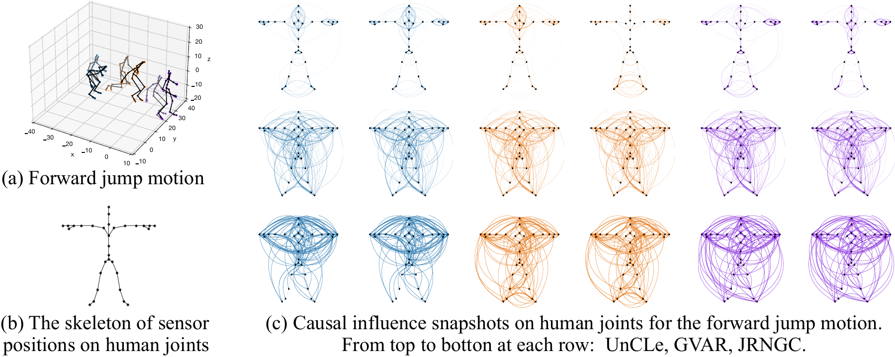
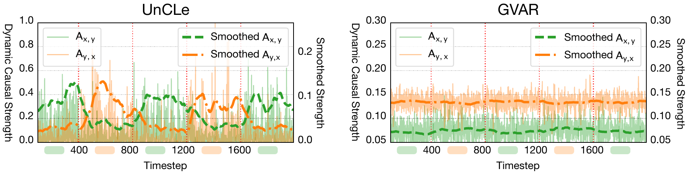
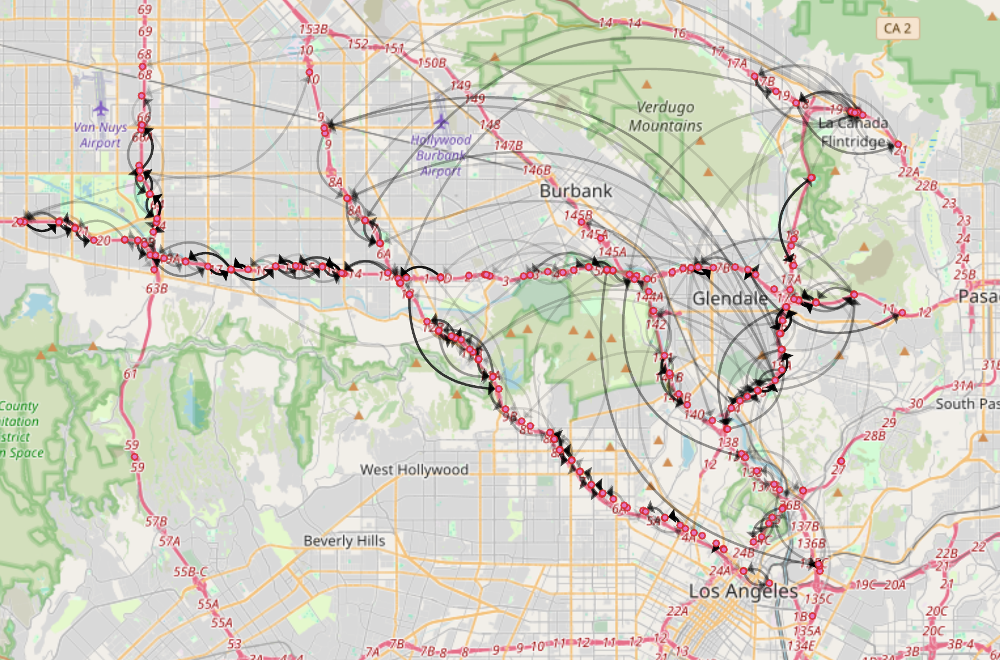
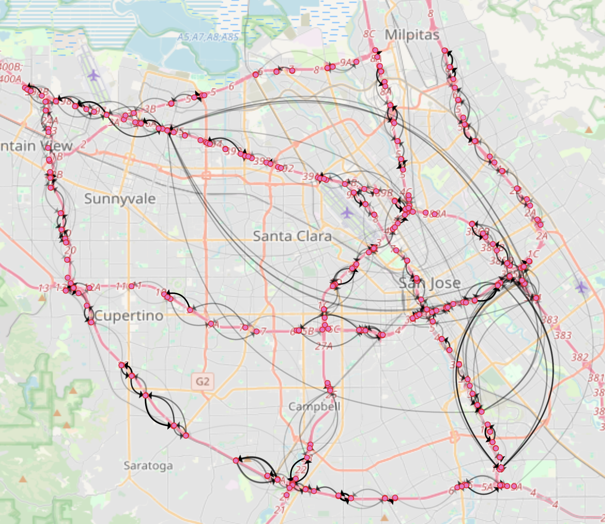
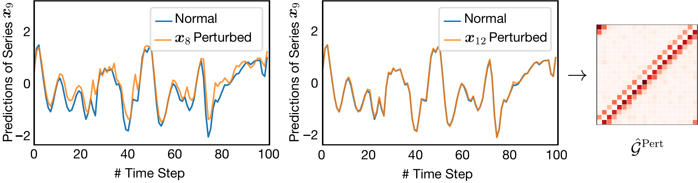

# 🧬 UnCLe

### Towards Scalable Dynamic Causal Discovery in Non-linear Temporal Systems

**NeurIPS 2025 · Main Conference**  
[Paper](https://papers.nips.cc/paper_files/paper/2025/hash/8a6afd9209b40e30bc4c69d2cf39f761-Abstract-Conference.html) · [Datasets](datasets/) · [Implementation](bin/experimental_utils.py)

UnCLe discovers **how causal relationships change over time** in nonlinear temporal systems. Shared Uncoupler and Recoupler networks learn latent representations of individual series, while dependency matrices model their interactions. After training, temporal perturbations reveal when one variable contributes to predicting another.

This repository contains the paper's implementation and benchmark data, including synthetic systems, finance, fMRI and human motion capture.

[Motion demo](#demo-causal-structure-changes-with-the-motion-phase) · [Traffic networks](#additional-results-on-large-scale-transportation-dataset-metr-la-and-pems-bay) · [Temporal perturbation](#demonstration-of-causal-influences-via-temporal-perturbation) · [Usage](#run-an-included-benchmark) · [Citation](#citation)

## Demo: causal structure changes with the motion phase



**Paper Figure 3.** A forward jump passes through crouch, flight and touchdown. Six chronological graph snapshots are aligned with the skeleton: the first row is UnCLe, followed by GVAR and JRNGC. UnCLe's inferred interactions shift from coordinated upper-body movement during crouching, to sparser lower-body coordination in flight, and to renewed whole-body involvement at landing.

The [human-motion video](datasets/MoCap/jump.avi) and [motion coordinates](datasets/MoCap/motion_16_09.csv) are included with the release.

### Tracking a switching causal direction



**Paper Figure 2.** The synthetic system repeatedly switches which variable drives the other. UnCLe tracks those changes in dominant direction, while GVAR's dominant direction remains unchanged. The figure retains the paper's Gaussian-smoothed strength curves and switch markers.

## Additional Results on Large-scale Transportation Dataset (METR-LA and PEMS-BAY)

The paper applies UnCLe to traffic-speed observations from **207 sensors in METR-LA** and **325 sensors in PEMS-BAY**, using **10,240 time points**. The inferred graphs are overlaid on the corresponding road maps, with nodes at the sensors' geographic locations.

### METR-LA



### PEMS-BAY



Most inferred connections link nearby sensors, while a small set of hubs has longer-range influence. The paper relates those hubs to airports and major overpasses, illustrating how traffic observations can reveal geographically interpretable network structure.

## Demonstration of causal influences via temporal perturbation



**Paper Figure 14.** The model predicts **x9** using the original observations (blue). Perturbing **x8** changes the prediction substantially (left), whereas perturbing **x12** has little effect (middle). The increase in prediction error quantifies the inferred influence of the perturbed series. The heatmap on the right is a **static summary** of the perturbation-derived causal graph, $\hat{\mathcal{G}}^{\mathrm{Pert}}$; the timestep-wise error changes also support dynamic analysis.

## How the causal graphs are obtained

| Output | How it is obtained | What it shows |
| --- | --- | --- |
| Dynamic graph, UnCLe(P) | Perturb a series and measure the increase in prediction error at each timestep | Changes in inferred causal influence throughout a sequence |
| Static graph, UnCLe(A) | Aggregate the learned channel-wise dependency matrices | A summary of interactions across the observed sequence |

### Model architecture


| Stage | Role |
| --- | --- |
| Uncoupler | Encode each observed series into latent channels |
| Dependency matrices | Model lagged interactions between variables within those channels |
| Recoupler | Map the coupled latent representations back to predicted observations |
| Temporal perturbation | Estimate causal influence from prediction-error changes |

## Repository map

```text
bin/
  experimental_utils.py   VARP implementation, training and evaluation
  run_grid_search.py      benchmark loader and experiment driver
  requirements.txt        released dependency versions
  run_*                   benchmark-specific shell launchers
datasets/
  Lorenz96/               three nonlinear dynamical-system settings
  NC8/                    static eight-variable benchmark
  ND8/                    dynamic eight-variable data and ground-truth matrices
  TVSEM/                  time-varying structural equation data
  Finance/                time series with supplied structures
  fMRI/                   time series with supplied structures
  MoCap/                  human-motion coordinates and a video
assets/
  model_arch.png          original architecture figure
  mocap-jump.png          paper Figure 3: human-motion causal snapshots
  tvsem-directions.png    paper Figure 2: switching causal direction
  traffic-metr-la.png     transportation results on METR-LA
  traffic-pems-bay.png    transportation results on PEMS-BAY
  temporal-perturbation.png  paper Figure 14: perturbation-based inference
```

## Run an included benchmark

The release pins PyTorch 1.13.1 and tsai 0.3.4. Use a Python environment compatible with those versions; Python 3.10 is a practical starting point. The existing runner uses CUDA by default. This is a research release, and these instructions do not imply that its training has been revalidated on newer library versions.

From the repository root:

```bash
python -m pip install -r bin/requirements.txt
python -m pip install networkx==3.0 PyYAML==6.0 sparsemax==0.1.9
cd bin
mkdir -p logs

python run_grid_search.py \
  --experiment unicsl_lorenz96_0 \
  --num-sim 5 \
  --K 8 \
  --num-hidden-layers 6 \
  --hidden-layer-size 20 \
  --num-epochs-1 1000 \
  --num-epochs-2 2000 \
  --initial-lr 0.005 \
  --seed 0 \
  --cuda-i 0
```

The extra dependencies above are imported directly by `experimental_utils.py` but are missing from the released requirements list. Running from `bin/` keeps the driver's `../datasets/` paths correct. Creating `logs/` avoids a missing-parent error in experiment logging. The direct command also omits the unsupported `--model gvar` argument present in `run_l96_0`.

### Available driver settings

| `--experiment` | Data |
| --- | --- |
| `unicsl_lorenz96_0` | 20 variables, force 10 |
| `unicsl_lorenz96_1` | 20 variables, force 40 |
| `unicsl_lorenz96_2` | 100 variables, force 40 |
| `unicsl_nc8` | Static eight-variable systems |
| `unicsl_finance` | Finance data; the driver selects even-numbered simulations |
| `unicsl_fmri` | fMRI data |

The shell launchers carry benchmark-specific hyperparameters and GPU indices. Inspect them before running: `run_finance` selects GPU 5 and `run_fmri` selects GPU 3. `run_nd8` requests an experiment that the released driver does not implement. ND8, TVSEM and MoCap data are included, but the current driver does not provide ready-to-run experiment branches for them.

### Outputs

From the working directory `bin/`, experiment summaries and estimated graph matrices are written beneath `logs/`. Training also writes checkpoints and logs beneath `runs/`. The evaluation code reports graph metrics such as AUROC, AUPRC and threshold-based accuracy. Consult `experimental_utils.py` for the exact output conventions before comparing a new run with paper results.

## Citation

```bibtex
@inproceedings{bi2025uncle,
  title={UnCLe: Towards Scalable Dynamic Causal Discovery in Non-linear Temporal Systems},
  author={Bi, Tingzhu and Pan, Yicheng and Jiang, Xinrui and Sun, Huize and Ma, Meng and Wang, Ping},
  booktitle={Advances in Neural Information Processing Systems},
  year={2025}
}
```
